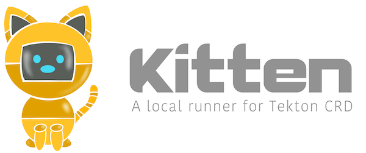

# Overview

Kitten is a local runner for Tekton CRD.
If you never heard about Tekton, check [here](https://tekton.dev/)

Kitten doesn't require a Kubernetes cluster to run
pipelines, it uses your (local) Docker installation
to execute the exact same sequence of containers,
reusing some of the Tekton component, and just
replacing the Kubernetes CRD objects and Pod
scheduling with in-memory state and plain Docker
containers.

This project mostly started as an exercice to 
improve my Go skills. But I imagine it can be used
to run local tests of your Tekton pipeline.

This project use raw Tekton CRDs, it doesn't define any higher level syntax 
to define your CI/CD process. Other open source projects such as [Jenkins X](https://jenkinsx.io)), have already integrated Tekton as the default pipeline engine.

## Installing
[need instructions for OS X and Linux]

## Testing Your Pipeline
[need examples of testing a local pipeline ]

###  Why a Kitty Cat Logo?
You've probably seen the Tekton logo, which is a robot cat. These days most Kubernetes-related project names start with the letter `K`, we did the same thing.

### Credits

- [ndeloof ](https://github.com/ndeloof) on starting this project and developing the core components

- [SharePointOscar](https://github.com/sharepointoscar) for using his under-utilized creative side to come up with our logo

